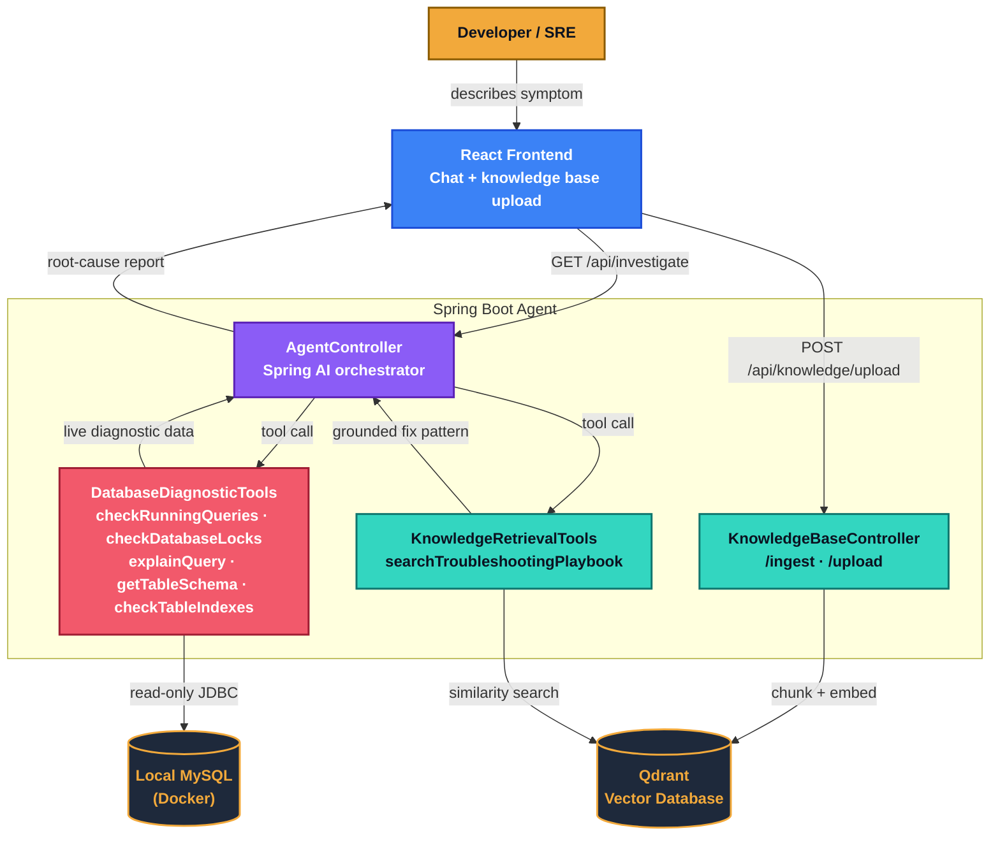

# MySQL Diagnostic Agent

An AI agent that investigates live MySQL incidents — lock waits, slow queries, missing indexes — by querying the database directly and grounding its fixes in a curated knowledge base, instead of guessing from general training knowledge.

---

## The problem

When a database starts timing out or locking up, diagnosing it is manual and slow: pull `PROCESSLIST`, check for lock waits, run `EXPLAIN` on suspect queries, remember (or search for) how a similar issue was fixed last time — usually under the pressure of an active incident.

Asking a generic AI chatbot doesn't help much here. It has no visibility into the live system, and it will confidently suggest fixes based on generic MySQL knowledge that may not match your actual schema, indexes, or history — sounding right without being right.

## What this does instead

This agent is wired directly into a live MySQL instance through a set of read-only diagnostic tools, and into a vector knowledge base of runbooks and past incidents. When you describe a symptom, it:

1. Queries the database itself — running queries, active locks, table schemas, indexes
2. Cross-references a knowledge base of troubleshooting playbooks, schema notes, and past incident writeups
3. Produces a root-cause report that cites the *actual* process IDs, tables, and queries it found — not placeholder examples

It's read-only by design. It recommends fixes (including `KILL` and `CREATE INDEX` statements); it does not execute them. A human decides whether to run them.

---

## Architecture



**Tech stack**

| Layer | Technology |
|---|---|
| Orchestrator | Java, Spring Boot, Spring AI |
| Diagnostic tools | Spring AI `@Tool`, JDBC (`JdbcTemplate`) |
| Knowledge base | Qdrant (vector store), Spring AI `TextReader` + `TokenTextSplitter` |
| Frontend | React |
| Database under test | MySQL 8, Docker |

---

## Diagnostic tools available to the agent

| Tool | What it does |
|---|---|
| `checkRunningQueries` | Lists queries running ≥2s from `information_schema.PROCESSLIST` (ignores idle pooled connections) |
| `checkDatabaseLocks` | Reads `sys.innodb_lock_waits` to find blocking/waiting process pairs |
| `explainQuery` | Runs `EXPLAIN` on a given `SELECT` to detect full table scans |
| `getTableSchema` | Returns column definitions for a table |
| `checkTableIndexes` | Returns indexes defined on a table |
| `listTables` | Lists tables in the current database |
| `searchTroubleshootingPlaybook` | Semantic search over the Qdrant knowledge base for a matching runbook or past incident |

All tools are strictly read-only. `explainQuery` rejects anything that isn't a `SELECT`, and table names are validated against a strict pattern before being used in SQL.

---

## Knowledge base

The agent's fixes are grounded in ingested documents rather than pulled from general model knowledge. The seed knowledge base includes:

- A general MySQL reliability playbook (lock waits, full table scans, sleeping connections)
- A schema reference for the test `orders` table, including which columns lack indexes
- Two fabricated-but-realistic past-incident postmortems tied to that schema

New knowledge — another runbook, a schema note, a one-line fix that worked — can be added at runtime via `POST /api/knowledge/upload`, without redeploying the app.

**Why this matters:** a generic LLM asked "why is the orders dashboard slow" will guess a plausible-sounding answer. This agent, grounded in the ingested schema notes, names the actual unindexed column and points to the specific past incident where it caused an outage.

---

## Example: real test run

To validate the agent, a lock wait was manually induced:

```sql
-- Session A
UPDATE orders SET amount = 999 WHERE id = 1;
-- left open, uncommitted

-- Session B
UPDATE orders SET amount = 100 WHERE id = 1;
-- hangs, then: ERROR 1205 (HY000): Lock wait timeout exceeded
```

Querying the agent (`GET /api/investigate?prompt=orders table updates are freezing`) returned:

> Based on the `checkDatabaseLocks` tool output, process **293** is blocking process **294**, which is attempting to update an order. To resolve the immediate lock wait, issue `KILL 293;` to terminate the blocking process and free the lock. After applying the fix, analyze the blocking query — if it filters on an unindexed column, create an index to prevent future full-table locks...

The reported process IDs (293, 294) match the live `sys.innodb_lock_waits` output exactly — the agent is reporting on the real incident, not reciting a templated answer.

---

## Running it locally

### 1. Start MySQL via Docker

```bash
docker run --name sre-mysql -e MYSQL_ROOT_PASSWORD=yourpassword \
  -e MYSQL_DATABASE=sre_db -p 3306:3306 -d mysql:8
```

### 2. Create the test schema

```sql
CREATE TABLE orders (
  id INT PRIMARY KEY AUTO_INCREMENT,
  customer_id INT NOT NULL,
  status VARCHAR(20) NOT NULL,
  amount DECIMAL(10,2),
  created_at TIMESTAMP DEFAULT CURRENT_TIMESTAMP
);
-- intentionally no index on customer_id or status
```

### 3. Configure the backend

In `application.properties`:

```properties
spring.datasource.url=jdbc:mysql://localhost:3306/sre_db
spring.datasource.username=root
spring.datasource.password=yourpassword
```

Set your Qdrant and model API credentials as well (see `application.properties.example`).

### 4. Run the backend

```bash
./mvnw spring-boot:run
```

### 5. Seed the knowledge base

```bash
curl -X POST http://localhost:8080/api/knowledge/ingest
```

### 6. Simulate an incident

Open two `mysql` CLI sessions and run the lock-wait sequence shown above.

### 7. Ask the agent

```bash
curl "http://localhost:8080/api/investigate?prompt=orders%20table%20updates%20are%20freezing"
```

### 8. (Optional) Run the frontend

The React app expects the backend at `http://localhost:8080` and requires CORS to be enabled on the backend for local development (see `CorsConfig`).

---

## API reference

| Endpoint | Method | Description |
|---|---|---|
| `/api/investigate` | GET | `?prompt=...` — runs a full diagnostic investigation and returns a report |
| `/api/knowledge/ingest` | POST | Ingests the bundled `mysql-playbook.txt` into the vector store |
| `/api/knowledge/upload` | POST | Ingests arbitrary text (`?source=name`, raw text body) into the vector store |

---

## Known limitations

Being upfront about the current state:

- **Guided, not fully dynamic, tool sequencing.** The agent currently follows a prompted order (check queries → check locks → search playbook) rather than deciding the next tool purely from intermediate results.
- **MySQL-only.** No application log correlation yet — see roadmap.
- **Occasional generic suggestions.** The agent has, on at least one run, suggested indexing an already-indexed primary key column when the real cause was an uncommitted transaction rather than a missing index. Its recommendations should be reviewed, not executed blindly — which is also why it's read-only by design.
- **Open ingestion.** `/api/knowledge/upload` has no auth or review step. Fine for a single-user local demo; would need access control before any shared use.
- **Manually authored seed knowledge.** The schema doc and incident postmortems were hand-written to match the test environment, not auto-generated from the live schema or a real incident tracker.
- **CORS wildcard.** The current CORS config (`allowedOrigins("*")`) is for local development only.

## Roadmap

- Dynamic tool selection based on intermediate findings, rather than a fixed sequence
- Application log correlation (start with local file/Docker log tailing; extend to Loki/CloudWatch)
- Auto-generated schema documentation via `INFORMATION_SCHEMA` introspection
- Human-approval gate in the UI before any suggested `KILL`/DDL statement is shown as copy-pasteable
- Authenticated, reviewed knowledge base ingestion
- Live tool-execution streaming (SSE) in the frontend, replacing the current per-response tool detection

---